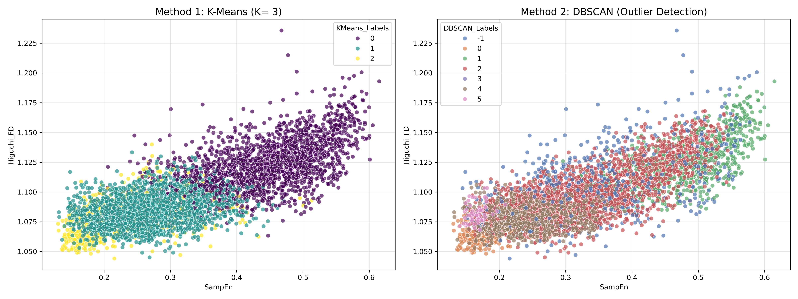
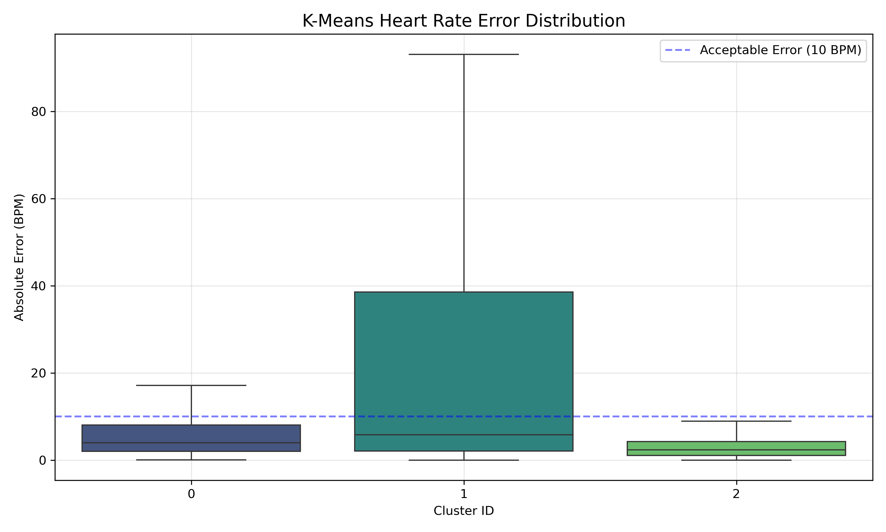
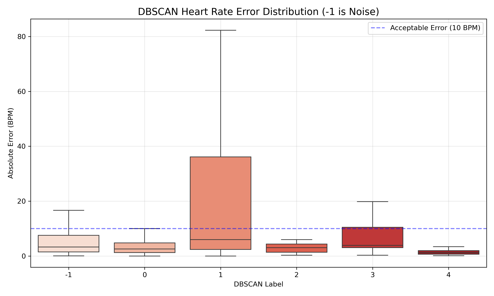

# Unsupervised Motion Artifact Removal for PPG Signals using K-Means & Non-linear Features

## Project Description
This project implements an unsupervised learning pipeline to identify and filter **Motion Artifacts (MA)** in wearable PPG signals. By extracting non-linear features such as **Sample Entropy** and **Higuchi Fractal Dimension**, the system compares clustering performance between **K-Means** and **DBSCAN** on the **PPG-DaLiA dataset**.

Results are validated against **ECG ground truth**, demonstrating that partition-based clustering (K-Means) effectively isolates high-error artifacts caused by rhythmic activities, achieving <10 BPM estimation error in clean clusters.

## Key Features
* **Non-linear Feature Extraction:** Sample Entropy (SampEn), Spectral Entropy, Higuchi Fractal Dimension (HFD).
* **Unsupervised Clustering:** Comparison between K-Means (Partition-based) and DBSCAN (Density-based).
* **Validation:** Quantitative analysis using Absolute Error (AE) against ECG heart rate
## Dataset
* **PPG-DaLiA:** A dataset for PPG-based heart rate estimation in real-life settings.

## Key Results

### 1. Feature Space Distribution
The visualization below compares K-Means and DBSCAN in the 2D feature space (Sample Entropy vs. Higuchi Fractal Dimension). 
* **K-Means** (Left) successfully segments the continuous gradient of physiological signals.
* **DBSCAN** (Right) creates a distinct gap that does not exist physically, leading to misclassification.

*(Figure 2 from report)*

### 2. K-Means Performance (Success)
Quantitative analysis using Absolute Error (AE) against ECG ground truth.
* **Cluster 2 (Clean):** Achieved an absolute error of **<10 BPM**, validating it as a reliable physiological signal source.
* **Cluster 1 (Artifacts):** Correctly isolated high-error segments (walking/stairs).

*(Figure 5 from report)*

### 3. DBSCAN Limitations (Failure Case)
DBSCAN failed to distinguish rhythmic motion artifacts from clean signals. As shown below, the "Noise" cluster (Label -1) actually contains high-quality signals (low error), while the "Core" cluster captures the rhythmic artifacts (high error) due to their high density.

*(Figure 10 from report)*

## Results Summary
* **K-Means (K=3):** Successfully segmented signals into "Clean", "Minor Motion", and "Major Artifacts". The "Clean" cluster achieved an absolute error of <10 BPM.
* **DBSCAN Failure Analysis:** DBSCAN failed to distinguish rhythmic motion artifacts (e.g., walking) from clean signals due to the continuous gradient distribution of physiological signal features in the feature space.

## Full Report

For detailed methodology and analysis, please refer to the [Project Report](Report_Unsupervised_PPG_Denoising.pdf).

---
**Author:** Wei Heng (M.S. Candidate in Biomedical Engineering, CYCU)

**Focus:** System Programming, Embedded Systems, Edge AI

